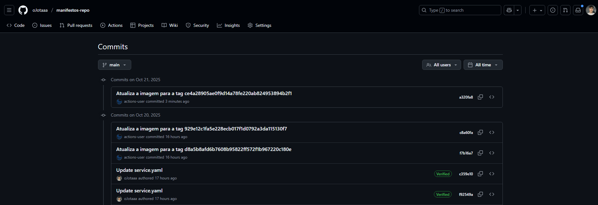
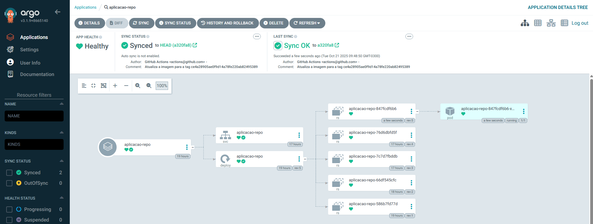
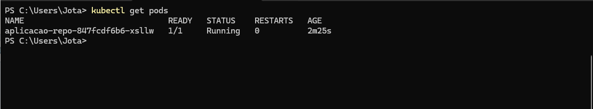
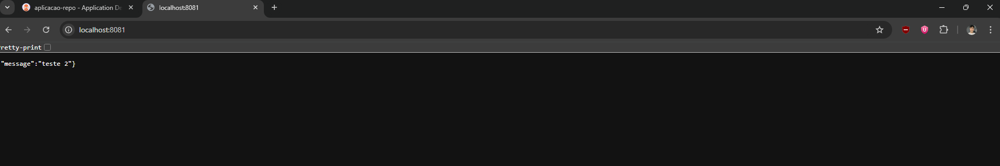

# - Projeto CI/CD: Manifestos Kubernetes (manifestos-repo)

Este repositório contém os manifestos Kubernetes (`deployment.yaml` e `service.yaml`) para o Projeto CI/CD com GitHub Actions.

Ele funciona como a **"Fonte da Verdade"** para o ArgoCD, implementando os princípios de GitOps.

**Repositório da Aplicação (CI):** [`github.com/oJotaaa/aplicacao-repo`](https://github.com/oJotaaa/aplicacao-repo)

## - Papel no Projeto: Entrega Contínua (CD) com GitOps

Este repositório é o centro da Entrega Contínua (CD). O ArgoCD monitora este repositório.

O fluxo de trabalho é o seguinte:

1.  A pipeline do `aplicacao-repo` faz um *push* automático para cá, atualizando a `image:` tag no `deployment.yaml`.
2.  O ArgoCD detecta a mudança (o novo commit) e seu status muda para `OutOfSync`.
3.  Após a sincronização (manual ou automática), o ArgoCD aplica o `deployment.yaml` atualizado ao cluster Kubernetes.
4.  O Kubernetes realiza um *rolling update*, substituindo o *pod* antigo pelo novo *pod* com a imagem atualizada.

---

## 📋 Entregas Esperadas (Evidências)

Abaixo estão as evidências de que o ciclo de CI/CD foi concluído com sucesso.

### 1. Evidência de Atualização Automática dos Manifestos 

A imagem abaixo mostra o histórico de *commits* deste repositório. Note o *commit* feito pelo `actions-user`: esta foi a pipeline de CI atualizando automaticamente a tag da imagem após uma mudança no `aplicacao-repo`.

### 2. Captura de Tela do ArgoCD Sincronizado 

A imagem abaixo mostra o painel do ArgoCD com a aplicação `aplicacao-repo` em estado `Healthy` (Saudável) e `Synced` (Sincronizado), provando que os manifestos deste repositório estão aplicados no cluster.

### 3. Print do `kubectl get pods` 

O comando abaixo confirma que o *pod* da aplicação está em execução (`Running`) no cluster Kubernetes.

### 4. Print da Resposta da Aplicação 

A prova final. Após rodar `kubectl port-forward`, a aplicação é acessada via navegador e mostra a mensagem atualizada ("teste 2"), confirmando que a nova imagem foi implantada com sucesso.

